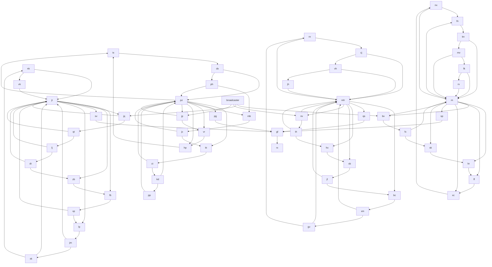

```mermaid
  graph TD;
       tx --> dx
       nx --> fn
       nx --> rn
       nr --> cj
       nr --> mh
       nk --> jt
       nk --> vk
       mv --> fk
       mv --> rn
       pz --> kt
       pz --> pg
       pz --> mb
       pz --> vr
       pz --> hp
       pz --> jp
       pz --> tx
       jt --> fb
       jt --> zb
       jt --> jq
       jt --> sv
       jt --> lp
       vp --> lp
       vp --> jt
       qs --> gf
       lj --> jt
       lj --> dt
       jh --> mh
       xc --> nx
       hx --> xb
       kd --> pz
       kd --> pp
       jq --> jt
       jq --> qt
       lp --> jm
       ph --> mb
       ph --> pz
       sv --> gf
       ff --> xc
       th --> mh
       th --> hx
       kt --> ct
       ct --> kd
       ct --> pz
       mh --> bc
       mh --> qs
       mh --> hx
       mh --> xb
       mh --> nv
       pg --> gf
       fn --> kn
       sk --> hr
       nv --> mh
       nv --> th
       dx --> pz
       dx --> ph
       broadcaster --> bx
       broadcaster --> jq
       broadcaster --> nv
       broadcaster --> jp
       dt --> jt
       dt --> zb
       fx --> sk
       fx --> rn
       rv --> rn
       gv --> mh
       gv --> nr
       fk --> rn
       fk --> rv
       cj --> mh
       cj --> vh
       xk --> jt
       xk --> nk
       vh --> mh
       vh --> jh
       zb --> fb
       mb --> jc
       kn --> rn
       kn --> mv
       jc --> pz
       jc --> kt
       sp --> gf
       hp --> tx
       jf --> bc
       jf --> mh
       fb --> vp
       xm --> mh
       xm --> gv
       jm --> jt
       jm --> xk
       vr --> hp
       hr --> ff
       jp --> pz
       jp --> vr
       rn --> fn
       rn --> hr
       rn --> bx
       rn --> ff
       rn --> xc
       rn --> sp
       rn --> sk
       pp --> pz
       gf --> rx
       xb --> jf
       bx --> rn
       bx --> fx
       bc --> xm
       qt --> lj
       qt --> jt
       vk --> jt
```
